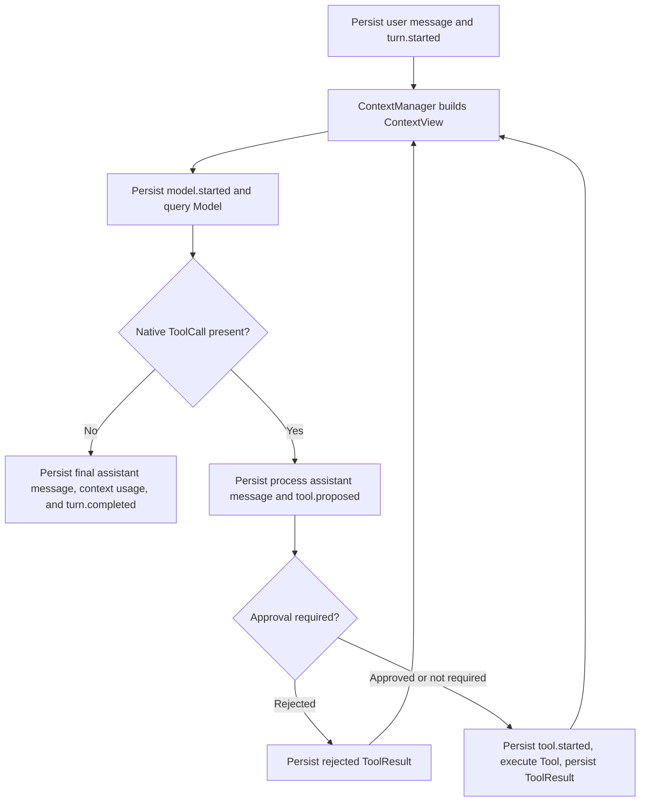

# Agent control flow

`AssistantAgent.receive(text)` handles every user message through the same model-driven loop. There is no fixed question, plan, execute, or review workflow.



The Model decides whether the current message needs a direct answer or a tool. The Agent owns protocol correctness, persistence, approval, limits, and the rule that a response containing ToolCalls cannot finish the turn. Every ToolCall receives exactly one ToolResult; after all results are saved, the Model is queried again. Only a non-empty assistant response without ToolCalls completes the turn.

`ContextManager` keeps the full `SessionState.messages` untouched. It builds the provider-visible view from stable instructions, active memory batches, and the uncompressed suffix. At the configured high-water mark, old turns are summarized by the same Model. Program code owns ranges, IDs, tree links, progress checks, and active-frontier replacement; the Model generates only summary text.

Every external Model or Tool call has a durable intent checkpoint. After a crash, unfinished calls are closed as failed or result-unknown and are never replayed automatically. Durable `RunEvent` records drive terminal output, benchmark progress, and future UI projections without changing the Agent loop.

??? note "AssistantAgent source"

    ```python
    --8<-- "src/minisweagent/agents/assistant.py"
    ```


